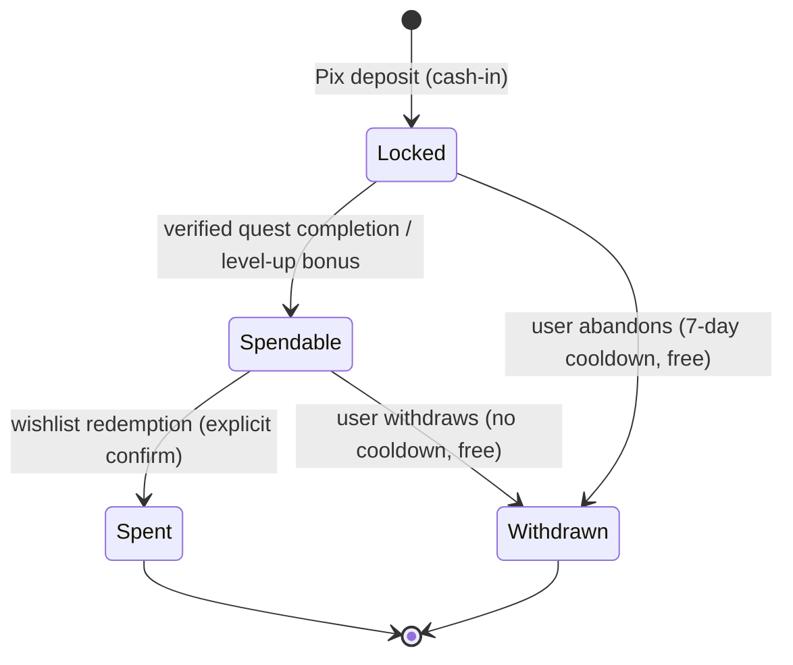
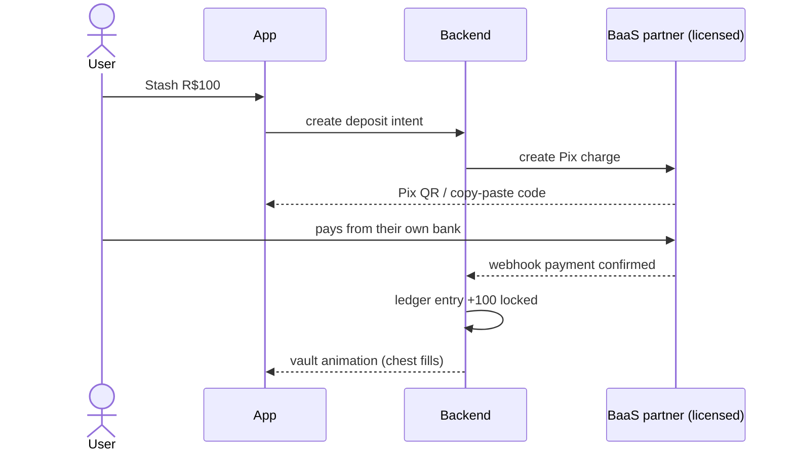
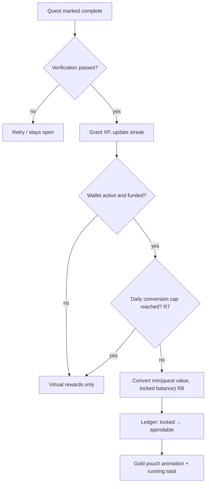
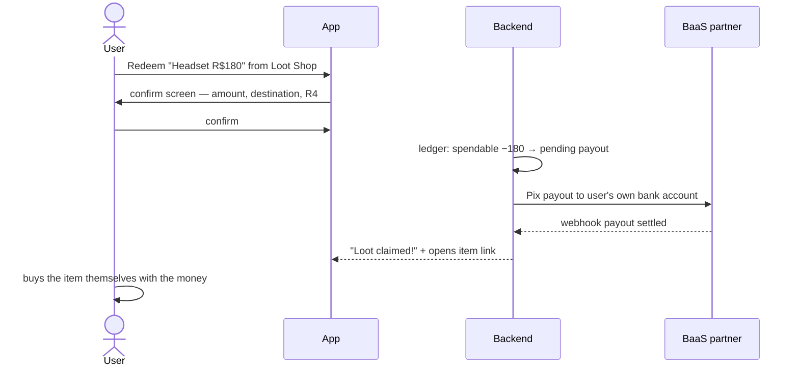
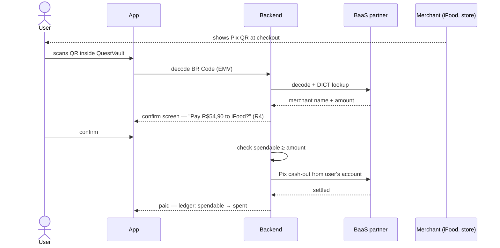
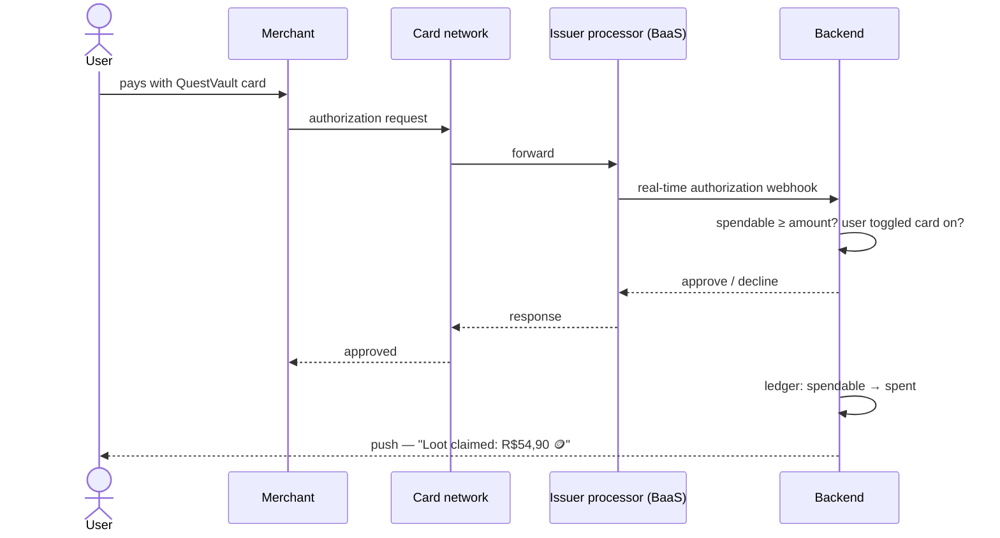
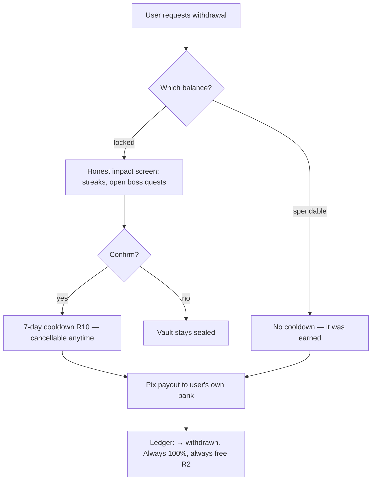
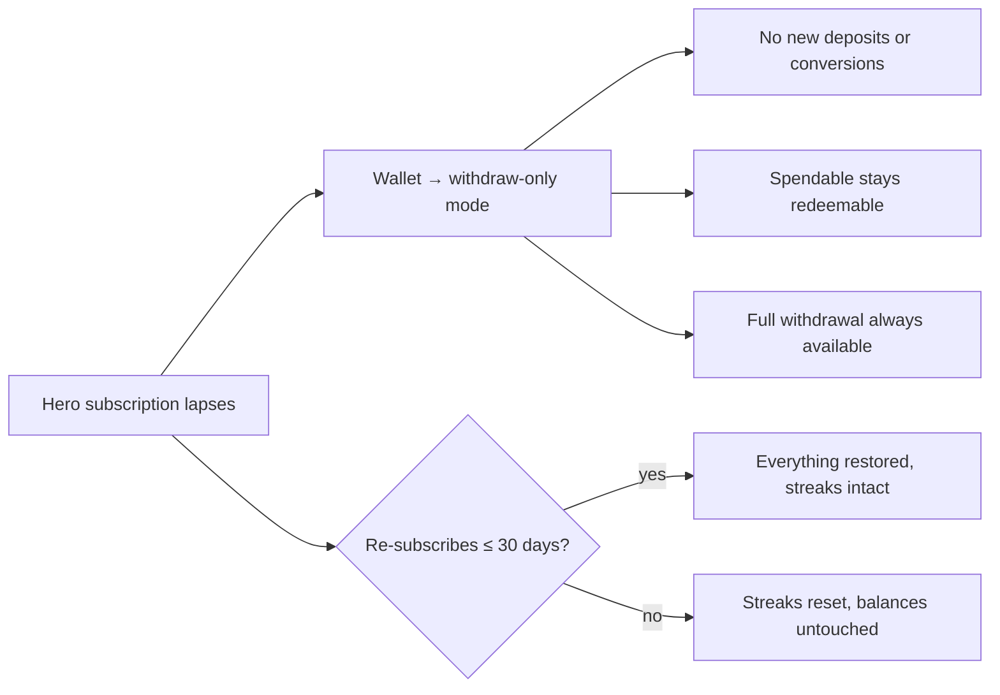
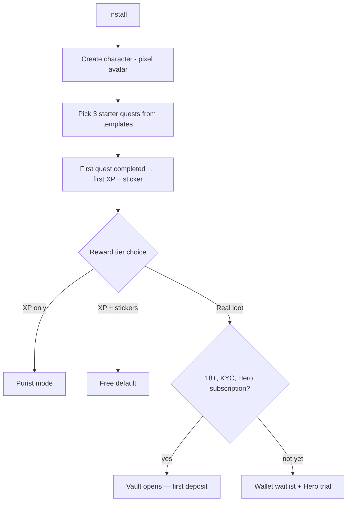

# 05 — Flows (drawn)

All diagrams are Mermaid: they render on GitHub and in VS Code. For slides, export from [mermaid.live](https://mermaid.live).

## 1. Credit lifecycle (the spine of the product)

Rules in play: R1 (always the user's money), R6 (only effort converts), R10 (withdrawal friction, never fees).

## 2. Deposit — "Stash gold" (Phase 2+)

## 3. Quest completion → conversion

## 4. Redemption — Phase 2 (payout model)

## 5. Redemption — Phase 3a (Pix QR scan at any checkout)

## 6. Redemption — Phase 3b (app card, JIT authorization)

The killer mechanism: the quest-gate is enforced at the point of sale, at any merchant on earth, with zero merchant integration.

## 7. Withdrawal — "Leaving the dungeon"

## 8. Subscription lapse (rule R12)

## 9. Onboarding & tier choice

