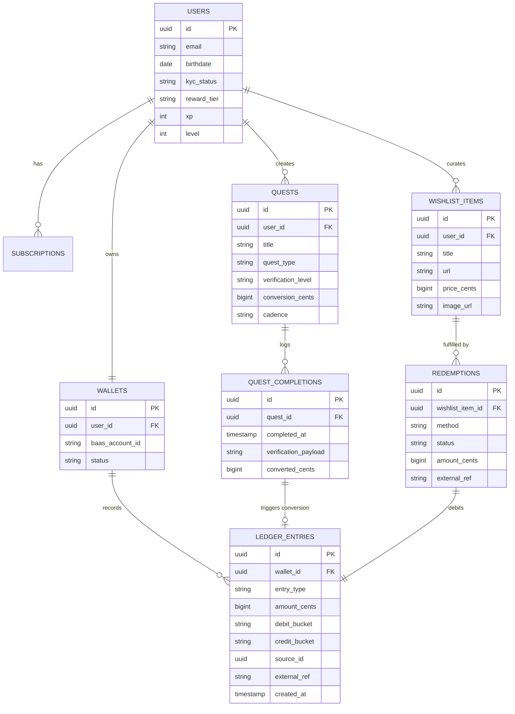

# 06 — Architecture

## Guiding constraints

1. **Phase 1 must ship with zero fintech and zero money UI.** The architecture is a normal app + a ledger module designed so money can be plugged in later without rewrites — but users never see balances, deposits, or conversion until Phase 2.
2. **The ledger is double-entry and immutable before real money goes live** — schema and invariants are designed in Phase 0–1, exercised in production only when Pix and BaaS land in Phase 2. No play-gold: fake balances would create migration debt and trust risk when real credits arrive.
3. **Money lives at the BaaS partner, never on our servers.** We hold ledger records that mirror the partner's accounts; KYC documents and card data never touch our infrastructure.

## Entity model

## Ledger design (the heart)

- Buckets per wallet: `locked`, `spendable`, `pending_out`, `spent`, `withdrawn`.
- Every movement is one immutable row moving value between two buckets (`debit_bucket` → `credit_bucket`). Balances are *derived* (sum or materialized view), never stored as a mutable column.
- Invariants enforced at the database level:
  - No bucket may go negative (rule R8 falls out for free).
  - `sum(all buckets) == sum(deposits) − sum(withdrawals) − sum(spent)` — auditable in one query.
  - `external_ref` ties entries to BaaS webhook ids → daily reconciliation job compares our ledger vs. partner statement; any divergence pages a human.
- Conversions reference their `QUEST_COMPLETION` (`source_id`) — every cent of spendable money is traceable to the effort that unlocked it. This is both rule R14 and a beautiful UI fact ("this headset was paid by 23 runs").

## Suggested stack (pragmatic, hire-friendly in Brazil)

| Layer | Choice | Why |
|---|---|---|
| Mobile | Flutter or React Native | One codebase; pixel-art UI is custom-drawn anyway, so native look matters less |
| Backend | NestJS (TypeScript) or Elixir/Phoenix | Webhook-heavy workload; both handle it well; TS maximizes hiring pool |
| Database | PostgreSQL | Transactional ledger integrity; row-level security |
| Queue/jobs | Redis + BullMQ (or Oban on Elixir) | Webhook processing, reconciliation, streak rollovers |
| Subscriptions | App stores (RevenueCat) + Stripe Billing for web | Phase 1 revenue without fintech |
| BaaS (Phase 2+) | Celcoin or QI Tech for accounts/Pix; Pomelo or Dock for card issuing | See vendor research; quote at least two per category |
| Analytics | PostHog (self-host option for LGPD comfort) | Funnel: install → quest → subscribe → deposit |

## Integration surface per phase

| Phase | External integrations | New risk introduced |
|---|---|---|
| 1 | App stores, RevenueCat/Stripe, PostHog | None (no user funds) |
| 2 | BaaS: KYC, Pix cash-in, Pix payout webhooks | Reconciliation, KYC UX drop-off |
| 3a | BaaS: BR Code decode, DICT, Pix cash-out | Real-time payment failures at checkout |
| 3b | Issuer processor: card creation, JIT auth webhook (≤ 2s response budget) | Auth latency SLA; card lifecycle support |

## Phase 1 validation without play-gold

Do **not** ship a play-gold vault in Phase 1. Fake money trains the wrong UX, couples the ledger to paths that bypass BaaS, and makes the Pix launch feel like a bait-and-switch. Instead:

- **Waitlist CTA** — "Notify me when the Vault opens" (see [04-monetization.md](04-monetization.md)) measures deposit intent.
- **Priced wishlist** — users save loot targets (title + link + price) without balances or progress bars tied to money.
- **Backend ledger** — keep schema and conversion logic ready in code, but inactive until Phase 2 enables the vault feature flag alongside BaaS.

Phase 2 is the first time users see locked/spendable balances, deposit via Pix, and redeem for real.
